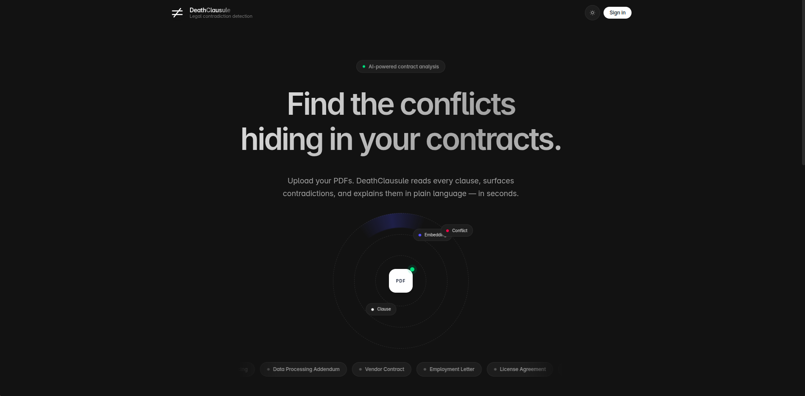
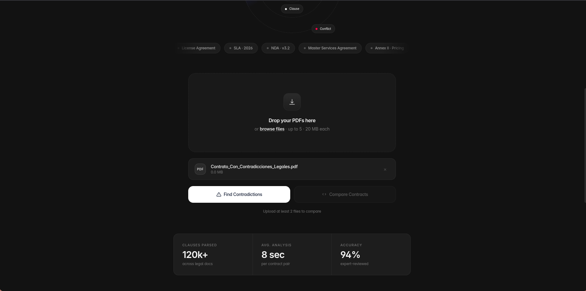
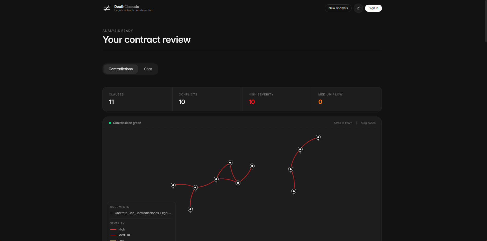
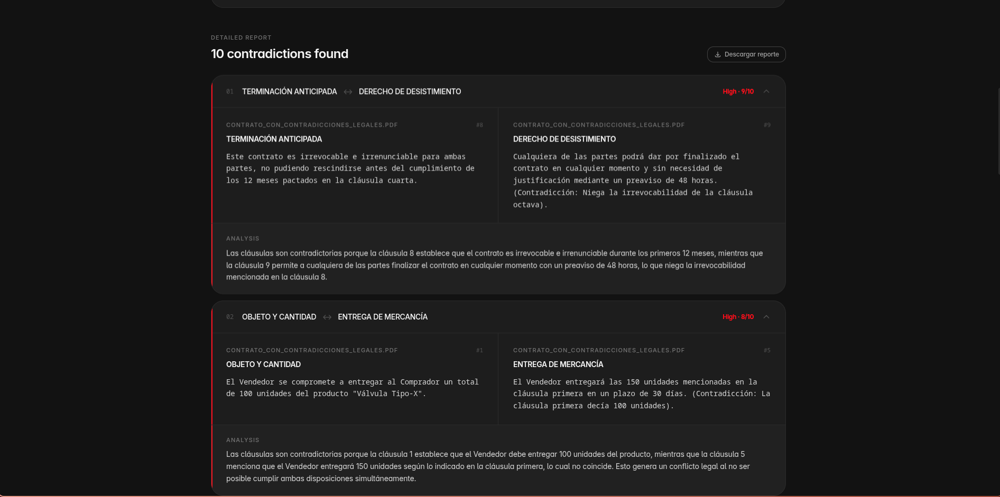
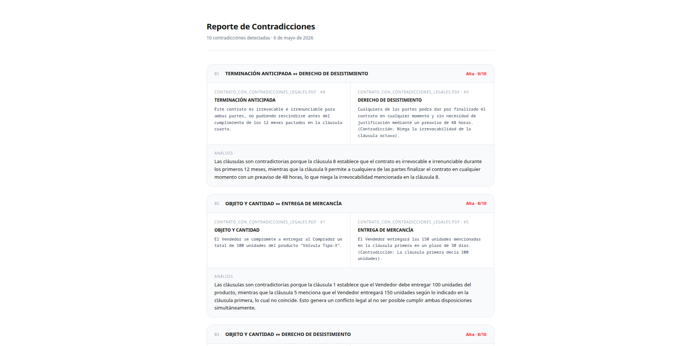
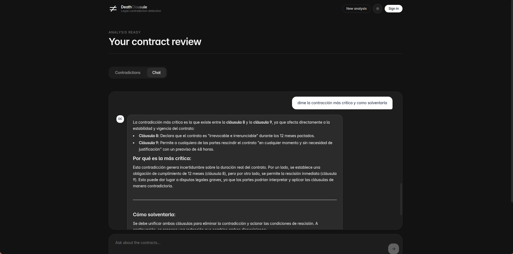
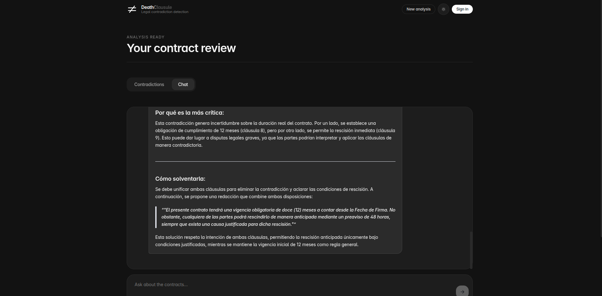
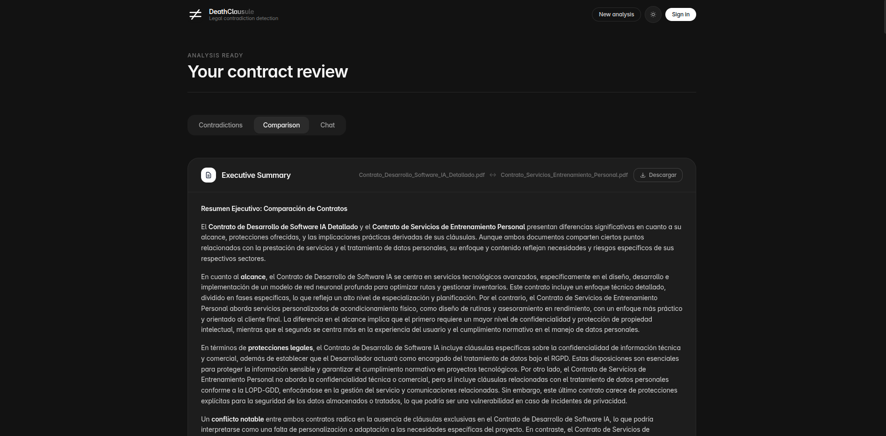
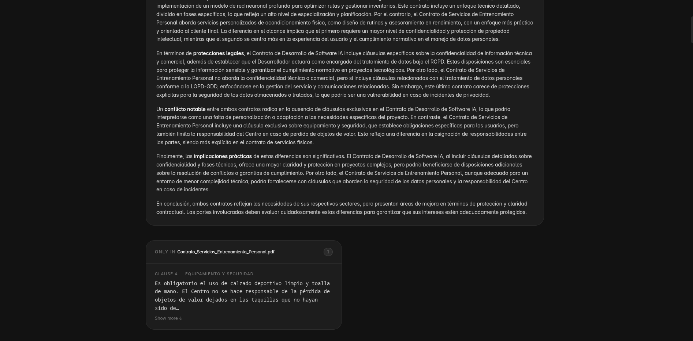
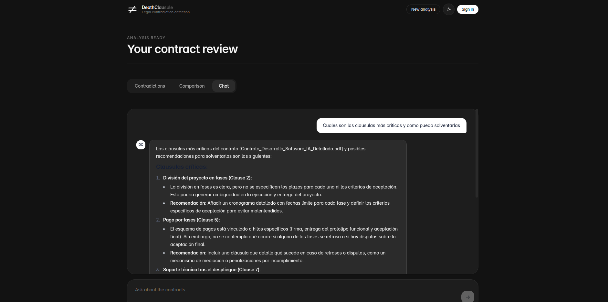

# DeathClausule

**Detección inteligente de contradicciones y comparación de contratos mediante IA Generativa.**

DeathClausule es una aplicación SaaS full-stack que permite a equipos legales y empresas analizar contratos en segundos. Sube uno o varios PDFs y la plataforma extrae automáticamente las cláusulas, las vectoriza y aplica un motor semántico para detectar contradicciones internas o diferencias críticas entre documentos — todo explicado en lenguaje natural.

---

## Funcionalidades principales

- **Detección de contradicciones** — Encuentra inconsistencias dentro de un mismo contrato o entre múltiples documentos. Cada contradicción se puntúa por severidad (1–10) y se explica en texto.
- **Comparación de contratos** — Analiza dos documentos en paralelo: identifica cláusulas exclusivas de cada uno, cláusulas similares con sus diferencias clave y genera un resumen ejecutivo.
- **Resumen ejecutivo** — Síntesis de 3–5 párrafos generada por GPT-4o con las implicaciones prácticas más relevantes.
- **Chat con los contratos** — Asistente de IA que responde preguntas sobre el contenido real de los documentos subidos, con citación de cláusula y documento.
- **Descarga de informes** — Exporta el informe de contradicciones o el resumen ejecutivo como HTML estilizado listo para imprimir.
- **Modo oscuro** — Interfaz adaptable con soporte completo para light/dark mode.

---

## Arquitectura técnica

```
Usuario
  │
  ▼
Frontend (React + Vite)
  │  REST API
  ▼
Backend (FastAPI)
  ├── Extractor (PyMuPDF + GPT-4o)   → divide el PDF en cláusulas numeradas
  ├── Embeddings (Azure OpenAI)       → text-embedding-3-small por cláusula
  ├── Vector Store (ChromaDB)         → almacena embeddings por sesión
  ├── Contradictions (GPT-4o)         → pares similares → veredicto + severidad
  └── Comparison (GPT-4o)             → cláusulas exclusivas + diferencias + resumen
```

**Flujo de datos:**

1. El usuario sube 1–5 PDFs (≤ 20 MB cada uno).
2. PyMuPDF extrae el texto crudo; GPT-4o lo divide en cláusulas estructuradas (número, título, cuerpo).
3. Cada cláusula se embebe con `text-embedding-3-small` y se almacena en ChromaDB, vinculada a la sesión.
4. Para detección de contradicciones: cada cláusula consulta sus vecinos semánticos más cercanos; los pares que superan el umbral de similitud se envían a GPT-4o en paralelo (ThreadPoolExecutor, hasta 10 llamadas concurrentes) para evaluar si existe contradicción real.
5. Para comparación: se identifican cláusulas exclusivas y similares entre documentos y se genera el resumen ejecutivo.
6. El frontend renderiza el grafo D3.js, el informe textual y el panel de chat, todos alimentados por la misma sesión vectorial.

---

## Stack tecnológico

| Capa | Tecnología |
|---|---|
| Backend | Python 3.11 · FastAPI · Uvicorn |
| Frontend | React 18 · TypeScript · Vite |
| Estilos | Tailwind CSS v4 · @tailwindcss/typography |
| IA | Azure OpenAI — GPT-4o · text-embedding-3-small |
| Vector DB | ChromaDB (persistido en disco por sesión) |
| PDF | PyMuPDF (fitz) |
| Visualización | D3.js v7 |
| HTTP client | Axios |
| Markdown | react-markdown |

---

## Estructura del proyecto

```
DeathClausule/
├── backend/
│   ├── main.py                  # FastAPI entry point + CORS
│   ├── routers/
│   │   ├── upload.py            # POST /upload — recibe PDFs, extrae y embebe
│   │   ├── analysis.py          # POST /analyze — detecta contradicciones
│   │   ├── comparison.py        # POST /compare — compara dos contratos
│   │   ├── chat.py              # POST /chat — chat RAG sobre los documentos
│   │   └── results.py           # GET /results — descarga resultados
│   ├── services/
│   │   ├── extractor.py         # PyMuPDF + GPT-4o clause chunking
│   │   ├── embeddings.py        # Azure OpenAI embeddings
│   │   ├── vector_store.py      # ChromaDB — get/create/query collection
│   │   ├── contradictions.py    # Detección de contradicciones paralela
│   │   └── comparison.py        # Comparación y resumen ejecutivo
│   ├── models/
│   │   └── schemas.py           # Pydantic models (Clause, GraphNode, etc.)
│   ├── requirements.txt
│   └── .env.example
├── frontend/
│   ├── src/
│   │   ├── components/
│   │   │   ├── Upload/          # Panel de subida de archivos
│   │   │   ├── Graph/           # Grafo D3.js de contradicciones
│   │   │   ├── Report/          # Informe textual con descarga
│   │   │   ├── Comparison/      # Resumen ejecutivo + cláusulas exclusivas
│   │   │   └── Chat/            # Chat con los contratos
│   │   ├── hooks/               # useAnalysis, useComparison
│   │   ├── api/                 # cliente Axios
│   │   └── types/               # tipos TypeScript de la API
│   └── package.json
└── README.md
```

---

## Despliegue local

### Requisitos previos

- Python 3.11+
- Node.js 18+
- Una cuenta de Azure con un recurso Azure OpenAI que tenga desplegados:
  - `gpt-4o` (o el nombre de tu deployment)
  - `text-embedding-3-small` (o el nombre de tu deployment)

### 1. Clonar el repositorio

```bash
git clone https://github.com/srincondelacruz/DeathClausule.git
cd DeathClausule
```

### 2. Configurar el backend

```bash
cd backend
python -m venv .venv
source .venv/bin/activate        # Windows: .venv\Scripts\activate
pip install -r requirements.txt
```

Copia el archivo de ejemplo y rellena tus credenciales:

```bash
cp .env.example .env
```

Edita `.env`:

```env
AZURE_OPENAI_ENDPOINT=https://<tu-recurso>.openai.azure.com/
AZURE_OPENAI_API_KEY=<tu-api-key>
AZURE_OPENAI_DEPLOYMENT_EMBEDDINGS=text-embedding-3-small
AZURE_OPENAI_DEPLOYMENT_GPT4O=gpt-4o
AZURE_OPENAI_API_VERSION=2024-02-01
CHROMA_PERSIST_DIR=./chroma_db
SIMILARITY_THRESHOLD=0.55
MAX_FILES=5
MAX_FILE_SIZE_MB=20
```

Arranca el servidor:

```bash
uvicorn main:app --reload --port 8000
```

La API quedará disponible en `http://localhost:8000`. Documentación interactiva en `http://localhost:8000/docs`.

### 3. Configurar el frontend

```bash
cd ../frontend
npm install
npm run dev
```

La aplicación estará disponible en `http://localhost:5173`.

### 4. Uso básico

1. Abre `http://localhost:5173`.
2. Sube uno o más PDFs (contratos, anexos, adendas).
3. Elige **Encontrar Contradicciones** o **Comparar Contratos**.
4. Explora el grafo interactivo, el informe detallado o el resumen ejecutivo.
5. Usa el chat para hacer preguntas específicas sobre las cláusulas.
6. Descarga el informe en HTML para compartirlo o imprimirlo.

---

## Variables de entorno

| Variable | Descripción | Valor por defecto |
|---|---|---|
| `AZURE_OPENAI_ENDPOINT` | URL del recurso Azure OpenAI | — |
| `AZURE_OPENAI_API_KEY` | Clave de API | — |
| `AZURE_OPENAI_DEPLOYMENT_EMBEDDINGS` | Nombre del deployment de embeddings | `text-embedding-3-small` |
| `AZURE_OPENAI_DEPLOYMENT_GPT4O` | Nombre del deployment de GPT-4o | `gpt-4o` |
| `AZURE_OPENAI_API_VERSION` | Versión de la API | `2024-02-01` |
| `CHROMA_PERSIST_DIR` | Directorio de persistencia de ChromaDB | `./chroma_db` |
| `SIMILARITY_THRESHOLD` | Umbral de similitud coseno (0–1) para considerar dos cláusulas relacionadas | `0.55` |
| `MAX_FILES` | Número máximo de archivos por sesión | `5` |
| `MAX_FILE_SIZE_MB` | Tamaño máximo por archivo | `20` |

---

## Autores

- **Sergio Rincón** — [srincondelacruz](https://github.com/srincondelacruz)

---

## Capturas de pantalla











